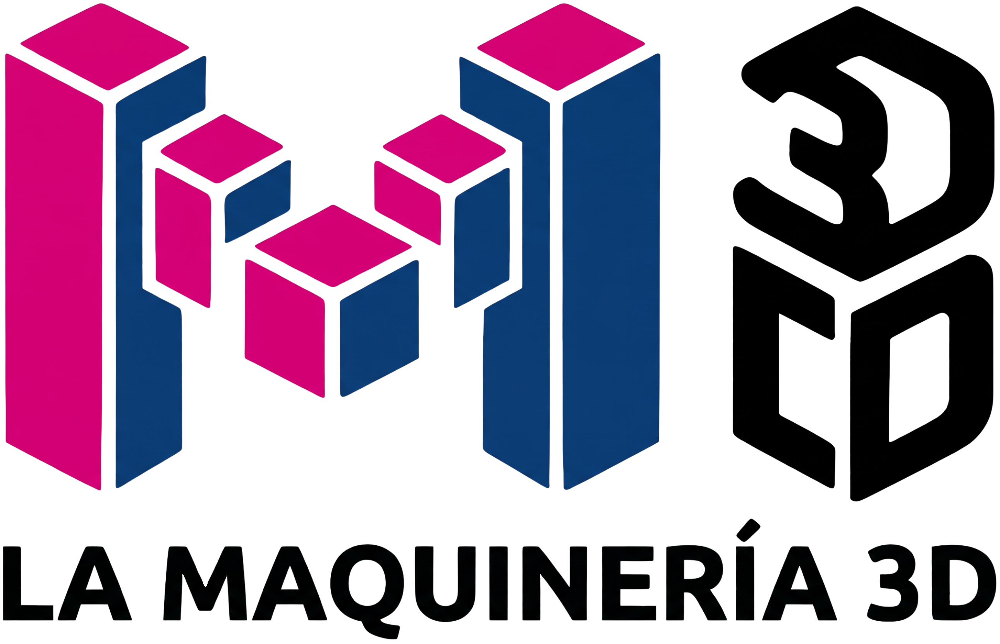

# 🛠️ La Maquinería 3D

> **Tus ideas, en 3D.** Servicio profesional de impresión 3D, prototipado rápido y fabricación digital.

---

## 📌 Sobre Nosotros

**La Maquinería 3D** es un emprendimiento apasionado por la tecnología y la fabricación digital. Nacimos con la convicción de que cualquier persona o empresa debe poder acceder a servicios de impresión 3D de alta calidad, sin complicaciones y con asesoramiento personalizado desde la idea inicial hasta la pieza terminada.

---

## 🧵 Materiales con los que trabajamos

Ofrecemos impresión 3D en materiales seleccionados para responder a diversas necesidades de resistencia, flexibilidad y acabado estético:

* **🟢 PLA (Ácido Poliláctico):** El material más popular y versátil. Ideal para prototipos visuales, objetos decorativos, maquetas y piezas de uso general.
* **🔵 PETG:** Excelente combinación de resistencia mecánica y química. Ideal para piezas técnicas, contenedores y componentes que requieran mayor durabilidad y soporte térmico.
* **🟡 TPU:** Filamento flexible y elástico. Perfecto para piezas que deben absorber impactos, doblarse o actuar como fundas, juntas y amortiguadores.

---

## 🚀 Secciones de la Landing Page

1. **Sobre Nosotros:** Presentación del proyecto y pilares de trabajo (Alta precisión, entrega rápida, trato personalizado y asesoramiento).
2. **Materiales:** Catálogo visual con las aplicaciones y beneficios de PLA, PETG y TPU.
3. **Cotizador Online:** Espacio preparado para la integración de cotización automática instantánea mediante la carga de archivos `.STL` y `.3MF`.
4. **Tienda:** Acceso directo a nuestra tienda oficial de productos en **MercadoLibre** con envío garantizado.
5. **Clientes:** Espacio reservado para exhibir testimonios y casos de éxito.
6. **Contacto:** Canales de comunicación directa y presencia en redes sociales (**Instagram** y **MercadoLibre**).

---

## 🌐 Sitio Web y Tecnologías

La landing page está desarrollada en **HTML5, CSS3 y JavaScript vanilla**, optimizada para ser desplegada en **GitHub Pages**.

* **Diseño UI/UX:** Tema oscuro (*Dark Mode*) fluido basado en la paleta corporativa `#E0006A` (Magenta) y `#1A2B6D` (Navy Dark).
* **Responsive & Interactivo:** Adaptado para dispositivos móviles, tablets y monitores de escritorio con microanimaciones y efectos visuales.

---

## 📩 Contacto y Redes

* 📸 **Instagram:** [@lamaquineria.3d](https://www.instagram.com/lamaquineria.3d)
* 🛒 **MercadoLibre:** [Tienda Oficial MercadoLibre](https://www.mercadolibre.com.ar)

---

*© 2026 La Maquinería 3D. Todos los derechos reservados.*
